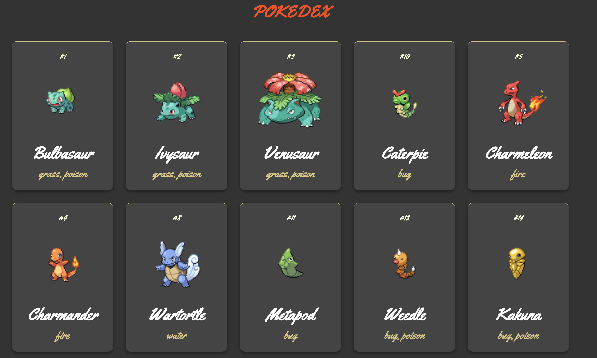

# Pokedex

* Learning TypeScript by featuring first generation pokemon in pokedex!

# Learning Goals

* Build a Pokedex featuring first generation Pokemon up to number 100.

* Learn the basics of TypeScript through creating this Pokedex. 

# Technology and Markup Languages 

* TypeScript

* CSS

* HTML

# API Refernce 

This project was built using [Pokemon API](https://pokeapi.co/).

# Credits 

Project built from [freeCodeCamp](https://www.freecodecamp.org/news/a-practical-guide-to-typescript-how-to-build-a-pokedex-app-using-html-css-and-typescript/)

